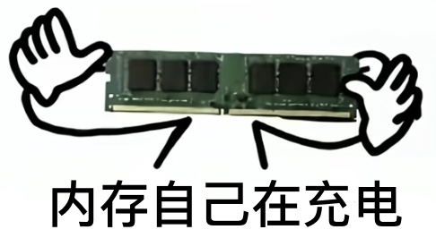

# WeFlow CLI

**English** | [简体中文](docs/zh-CN/README.md)

`weflow` is a native Rust command-line build of the [WeFlow](docs/weflow-readme.md) backend. No Electron desktop app is needed: it reads, analyzes, and exports local WeChat 4.0+ chat history directly from the terminal.

- Human-readable text by default (aligned `key: value` fields and tables; errors go to stderr). Add `--json` to print a single JSON document on stdout (`{"success": true, "data": ...}`) for scripting.
- Sessions, messages, contacts, and Moments; private and group chat analytics; annual reports and dual reports.
- Message export in 9 formats: `txt`, `json`, `arkme-json`, `chatlab`, `chatlab-jsonl`, `excel`, `weclone`, `html`, and `sql`.
- Images (`.dat` decryption), voice (SILK → WAV), video lookup, and stickers.
- Local HTTP API (token authentication, SSE push, `serve --http`), message push, and AI insights.
- `--help`, argument errors, runtime errors, and generated text follow the system language (Chinese or English) by default; `./weflow lang en|zh` saves your choice.

> [!WARNING]
> The CLI was ported from the original TypeScript backend. The database layer is pure Rust (it decrypts WeChat databases itself and reads them read-only) and has been verified against one real Windows WeChat 4.x account (with a Linux build, and with `weflow.exe` running on Windows). WeChat data from macOS/Linux has not been tested yet (verification limits: [section 4](docs/cli-unsupported.md#4-platform-and-verification-limits)). Expect some rough edges; feedback is welcome. What is and isn't covered: [coverage](docs/cli-coverage.md) · [unsupported features](docs/cli-unsupported.md).

For the original WeFlow project (the Electron desktop app), see [docs/weflow-readme.md](docs/weflow-readme.md).

## Build

```bash
make release
cp target/release/weflow .
./weflow --help
```

## Switching between English and Chinese

```bash
./weflow lang en
```

The language affects `--help`, argument errors, runtime errors, and generated text. JSON keys and error codes stay in English, and so do HTTP API error responses. For the full precedence order, see [docs/native-cli.md](docs/native-cli.md#language).

## Check ffmpeg

WeFlow CLI decodes WeChat's WXGF images itself. ffmpeg is only used for a WXGF image its decoder cannot read (for example 10-bit, 4:2:2
or 4:4:4 pictures), so this step is optional. To have one ready,
check whether one is found:

```powershell
./weflow ffmpeg path
```

> stdout: `source: PATH` (or `FFMPEG_PATH` / `installed`); `source: missing` means no ffmpeg was found

If it says `missing`, install the build the desktop app bundles (it is checked against its SHA-256), then check again:

```powershell
./weflow ffmpeg install
./weflow ffmpeg path
```

> stdout: `source: installed`

If GitHub is slow or unreachable, download from a mirror instead: run
`./weflow ffmpeg set baseurl https://registry.npmmirror.com/-/binary/ffmpeg-static` before `ffmpeg install`. Without ffmpeg,
such images are not exported, and the export says how many (`ffmpegMissing`) and when each was sent
(`ffmpegMissingImages`), so you can find them in WeChat.

## First-time setup and export (required steps)

**Run PowerShell as administrator.** WeChat 4.0 or later is supported, and you must have logged in to a WeChat account at least once, sent messages, and opened images.

1. Set the WeChat data directory

```powershell
./weflow db detect
./weflow config set db_path "C:\Users\<you>\Documents\xwechat_files"
```

> stdout: `db_path: C:\Users\<you>\Documents\xwechat_files`

2. Set your wxid

```powershell
./weflow db wxid
./weflow config set wxid wxid_xxxxxxxx
```

> stdout: `wxid: wxid_xxxxxxxx`

3. Set the database key

```powershell
./weflow key db
./weflow config set decrypt_key <database-key>
```

> stdout: `decrypt_key: <database-key>`

4. Set the image keys

```powershell
./weflow key image
./weflow config set image_xor_key <image-xor-key>
./weflow config set image_aes_key <image-aes-key>
```

> stdout: `image_xor_key: <image-xor-key>` <br>
> stdout: `image_aes_key: <image-aes-key>`

`./weflow config list` shows the saved configuration, and `./weflow config path` shows where the configuration file lives.

---

**What does `weflow key db` do?** <br>The database key is generated in memory when WeChat opens its databases. The command extracts `decrypt_key` from that memory location:

```
WeChat is running (pid 31912). Quit it completely first:
system tray icon -> right click -> Quit WeChat
Waiting for WeChat to quit... (exits automatically in 178 s)
WeChat has quit. Open it again.
Waiting for WeChat to start... (exits automatically in 171 s)
WeChat found (pid 20816). Click "Enter WeChat" in the login window.
Waiting for the key... (exits automatically in 150 s)
Database key obtained
decrypt_key: <database-key>
```

The 180-second automatic exit can be adjusted with `./weflow key db --timeout <seconds>`.

## What the CLI does not support

The WeFlow Rust CLI ~~, since my skills aren't up to it,~~ opens databases **read-only** and never modifies WeChat databases ~~— I'm not taking the blame for that~~. Commands that would modify a database (`chat update-message`, `chat delete-message`, `chat anti-revoke`, `chat mark-read`, `sns block-delete`, and `sns delete`) are designed as placeholders. Some desktop-app features are also missing (desktop-process features such as voice-to-text and popups).

See [docs/cli-unsupported.md](docs/cli-unsupported.md)for the detailed list

## Documentation

- [Command list](docs/native-cli.md)
- [What the CLI does not support (detailed list)](docs/cli-unsupported.md) · [Coverage of the original backend](docs/cli-coverage.md)
- [Desktop app on the Rust database layer](docs/desktop-rust-layer.md)
- [About `wcdb_api.dll`: the CLI and new desktop app don't depend on it; old vs. new builds](docs/wcdb-api.md)
- [HTTP API](docs/HTTP-API.md) · [macOS key troubleshooting](docs/MAC-KEY-FAQ.md)
- [Original WeFlow README](docs/weflow-readme.md) · [Español](docs/es-ES/weflow-readme.md)

# Disclaimer

<div id="disclaimer">

## 1. Project purpose and nature

This project (hereinafter “the Project”) was created as a technical research and learning tool for exploring and studying text statistics and analysis techniques. The Project is based on [Attention Is All You Need](https://arxiv.org/abs/1706.03762) and was generated fully automatically by pure [SI](https://www.whitehouse.gov/presidential-actions/2026/09/inaugurating-the-era-of-super-intelligence/), with 0% human content.

<table>
  <tr>
    <td></td>
    <td></td>
    <td></td>
    <td></td>
  </tr>
</table>

<table>
  <tr>
    <td></td>
    <td></td>
    <td></td>
  </tr>
</table>

## 2. Legal compliance

The developer of the Project (hereinafter “the Developer”) solemnly reminds users to strictly comply with the relevant laws and regulations of the People's Republic of China when downloading, installing, and using the Project, including but not limited to the Cybersecurity Law of the People's Republic of China, the Counter-Espionage Law of the People's Republic of China, and all other applicable national laws and policies. Users bear sole responsibility for any legal liability that may arise from using the Project.

## 3. Restrictions on use

The Project must not be used for any illegal purpose or for any commercial activity other than learning and research. It must not be used to illegally intrude into anyone else's computer system in any form, or to infringe anyone's intellectual-property rights or other lawful rights and interests. Users must ensure that they use the Project purely for personal learning and technical research, and not for illegal activity of any kind.

## 4. Data collection

The Project does not collect, store, or transmit any user data; everything runs locally. Users must ensure that their use of the Project complies with applicable laws and regulations.

## 5. Disclaimer of liability

The Developer has made every effort to ensure the legitimacy and safety of the Project, but accepts no liability for any direct or indirect loss of any kind that may result from its use, including but not limited to data loss, device damage, or legal proceedings.

## 6. Intellectual property

The intellectual property of the WeFlow project belongs to its developer, [hicccc77](https://github.com/hicccc77). The Project is protected by copyright law, international copyright treaties, and other intellectual-property laws and treaties. Users may download and use the Project provided that they comply with this statement and all applicable laws and regulations.

## 7. Final interpretation

The right of final interpretation of the Project belongs to its developer, [hicccc77](https://github.com/hicccc77). The Developer reserves the right to change or update this disclaimer at any time without notice.
</div>
