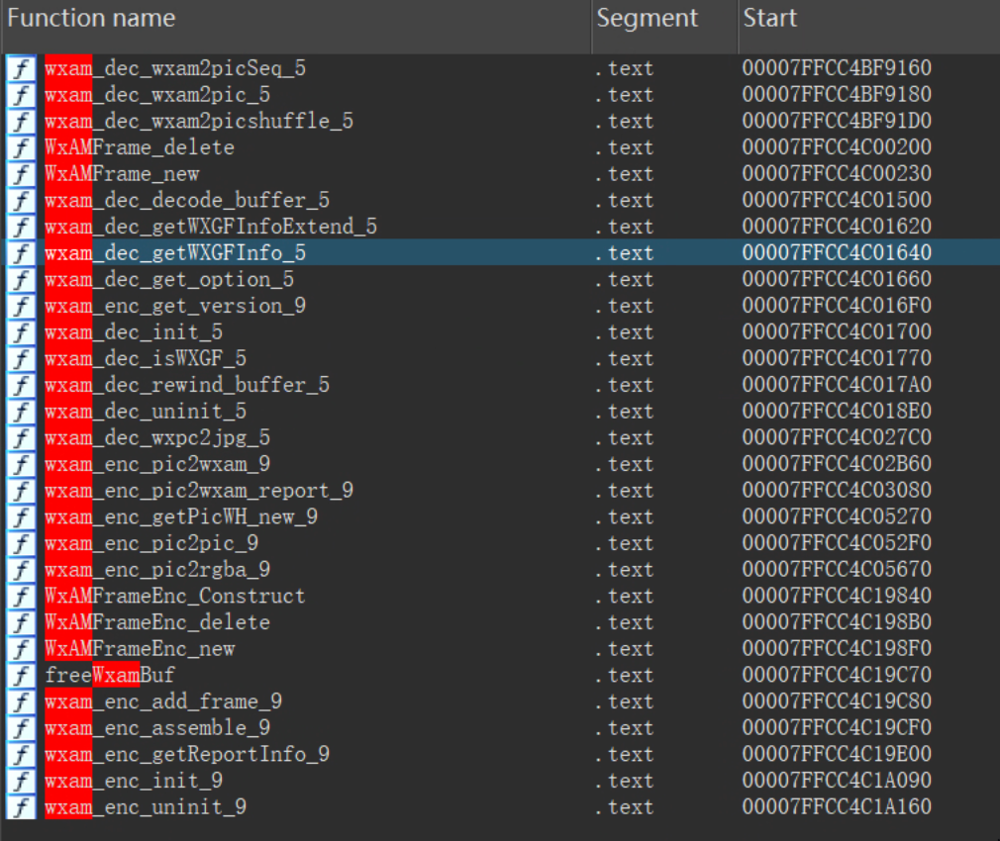

# WXAM（WXGF）图片格式解析

原文：https://sarv.blog/posts/wxam/

2025-08-19 · 8 分钟 · Sarv

### 概述

微信 4 的正式版本更新了图片加密算法，从测试版的通用 AES 密钥调整为每台设备不同的 AES 密钥。  
老样子，从内存数据中将 AES 密钥扒拉出来，然后就遇到了 WXAM 图片数据。  
经过不少时间的分析和处理，chatlog 目前已经能够初步解析 WXAM 图片了，写篇博客记录一下。

相关代码：[wxgf.go](docs/sarv.blog/posts/wxam/wxgf.go)

### 相关资料

由于是内部格式，网上能找到的资料少的可怜，唯一的官方信息是18 年腾讯工程团队发布的文章：[如何节省 1TB 图片带宽？解密极致图像压缩-腾讯云开发者社区-腾讯云](https://cloud.tencent.com/developer/article/1028362)  
明确了几点信息，WXAM 格式的目标是极致压缩比，并且应该是没有加密逻辑。

其余资料：

- [写在 wechat-dump 项目的第十年 - Yuxin’s Blog](https://ppwwyyxx.com/blog/2025/wechat-dump-10-years/#WXGF-%E8%A7%A3%E7%A0%81) Yuxin Wu 大佬尝试直接使用 Android 微信的 `libwechatcommon.so` 进行解码。
- [GitHub - recarto404/WxDatDecrypt: 解密与查看微信 4.1 的图片，将微信缓存的 dat 文件解密为原始图片格式](https://github.com/recarto404/WxDatDecrypt)
  recarto404 大佬发布了支持 wxgf 的微信图片查看器，使用的是 Windows 微信的 `VoipEngine.dll` 进行解码。
- [Fuzzing WeChat’s Wxam Parser | Advanced Offensive Cybersecurity Training](https://signal-labs.com/fuzzing-wechats-wxam-parser/) Christopher Vella 写了一篇模 wxam 糊测试案例，同样是分析了`VoipEngine.dll`

以上就是全网能找到的有价值的 WXAM 图片格式信息了，还有例如微信官方在一次更新时，错误的将 wxgf 图片分发给了小程序，导致图片无法解析（哈哈哈哈哈：[微信开放社区](https://developers.weixin.qq.com/community/develop/doc/0000c84a7080f8cb5322246ff6b800?jumpto=comment&commentid=00082af34d4eb01b5a225787966c)  
虽然资料较少，但是目标还挺清晰的，直接利用官方的 dll 进行分析，只要分析出编码机制，就能编写转换代码了，计划通！直到我遇到了…哈哈先卖个关子。

### 分析过程

使用 IDA 打开 `VoipEngine.dll` 文件，直接按照关键词查询，就能看到. 晰的函数名称。  


从 `wxam_dec_wxam2pic_5` 函数入口开始分析，写点注释，做点笔记，稍微耐心一点，一般都能梳理出整体的处理框架。   
现在做逆向分析比之前要轻松不少，可读性较差的 pseudocode 可以直接丢给 LLM，能够得到比较容易理解的结果，甚至 IDA Pro 还有 MCP（还没试过）。  
猜测是因为有较重的历史包袱，所以 WXAM 的代码中充满各种分支判断和参数配置，所以在分析时尽量按照层级处理，不要追着 call 一路 F7，会迷路的。

第一轮函数分析，感觉良好，这是一个结构清晰的函数，感觉马上就能完成解析。

```shell
sub_7FFD9B5D2540            // 入口
├─ wxam_dec_isWXGF_5        // 判断 Header
├─ wxam_dec_init_5          // 初始内存分配
├─ wxam_dec_decode_buffer_5 // 第一次调用 decode
├─ wxam_dec_get_option_5    // 第一次调用 get option
├─ wxam_dec_get_option_5    // 第二次调用 get option
├─ wxam_dec_decode_buffer_5 // 第二次调用 decode
├─ wxam_dec_get_option_5    // 第二次调用 get option
├─ sub_7FFD9B5D1B50         // 图像处理（核心？）
└─ wxam_dec_uninit_5        // 收尾
```

第二轮函数分析，感觉良好，专注在 `sub_7FFD9B5D1B50` ，学习如何将 RGBA32 转为 JPG，alpha 通道如何处理，直到我看到了 `lea rcx, String2; "JPEGMEM"`，原来看了半天是 `libjpeg`。

```shell
sub_7FFD9B5D1B50    // 逐行图像处理，4 转 3
├─ sub_7FFD9B5913C8 // 内存分配，分配值为宽度*3
├─ sub_7FFEA5A8FC10 // 初始化错误/消息管理器结构体 类似 libjpeg jpeg_std_error（？？？）
├─ sub_7FFEA5A8FCE0 // 创建解码器对象
├─ sub_7FFEA5A900C0 // 类似 jpeg_source_mgr
├─ sub_7FFEA5A90E80 // 类似 jpeg_read_header
├─ sub_7FFEA5A90FE0 // 设置自定义解压选项 rdx 接收 1-100 的值，猜测是质量
├─ sub_7FFEA5A914B0 // 类似 jpeg_start_decompress
├─ sub_7FFEA5A91570 // 循环调用 jpeg_read_scanlines，看到 lea rcx, String2; "JPEGMEM" （WTF）
├─ sub_7FFEA5A8FE10 // jpeg_finish_decompress
└─ sub_7FFEA5A8FE00 // jpeg_destroy_decompress 清理函数 避免内存泄露
```

第三轮函数分析，感觉良好，回过头开始分析 `wxam_dec_decode_buffer_5`，了解了 WXAM 的 Header 处理逻辑。

```shell
wxam_dec_decode_buffer_5 // rcx handle; rdx 数据指针; r8 数据大小
└─ sub_7FFD9B5CB1E0         // 解析核心函数 rdx 数据指针 r8; r8 数据大小
   ├─ sub_7FFEA5A5F2B0      // 数据预处理
      ├─ sub_7FFEA5A5DD40   // 解析 Header
      └─ sub_7FFEA5A5C900   // 解析额外参数（version >=2 且 [rbx+59h] 为 0）
   ├─ sub_7FFEA5A5B990      // 数据区块解析
<...>
```

第四轮函数分析，分析到一半看到 `A110` 函数天都塌了，好好好，`A110` 指向了内部的 Vcodec2 视频解码库，微信你用 HEVC 存静态图片！怪不得你压缩率高！

```shell
sub_7FFD9B5CB1E0     // 解析核心函数
   ├─ sub_7FFEA5A5F2B0  // 数据预处理
   ├─ WxAMFrame_new     // 创建帧
   └─ sub_7FFEA5A5C1D0  // 解码流程控制
      ├─ sub_7FFCC4C4A110 // 解析一个原始的、包含视频元数据和/或图像数据的 NALU (Network Abstraction Layer Unit) 码流
      └─ sub_7FFCC4BFFB60 // 图像转换或处理
         └─ sub_7FFCC4C1BEE0 // case 3 图像格式转换调度器
            └─ sub_7FFCC4C1D390 // mode 0 通用处理函数 YUV420P 到 BGRA32 的转换函数

sub_7FFCC4C4A110 (解码器主循环/NAL流处理器) - 顶层控制器，负责从输入比特流中读取数据，识别并分离出独立的NAL单元，然后将其送往NAL分发器进行处理。
└─ sub_7FFCC4C4BE80 (NAL单元分发器) - 接收单个NAL单元，判断其类型（如SPS, PPS, VPS, 或 VCL Slice），并将包含图像编码数据的VCL单元送入核心解码流水线。
   └─ [VCL Slice NAL 单元处理分支]
      ├─ sub_7FFCC4C51050 (Slice头解析器) - 从比特流中读取并解析Slice Header，提取解码当前画面切片所需的全部语法元素（如切片类型、参考帧信息等）。
      ├─ sub_7FFCC4CB5550 (参考帧列表构建器) - 根据Slice Header中的信息，构建解码器进行帧间预测所依赖的参考图像列表（List 0 和 List 1）。
      └─ sub_7FFCC4C4DC00 (Slice解码与图像重建循环) - 作为核心驱动引擎，按编码树单元(CTU)的顺序，循环处理整个Slice，调用具体模块完成像素重建。
         ├─ sub_7FFCC4C4CC40 (单个CTU解码器) - 解码流程的核心，负责对一个编码树单元(CTU)完成所有关键转换：熵解码(CABAC)、反量化、反变换、预测（帧内/帧间）以及最终的像素块重建。
         └─ sub__7FFCC4C4EA20 (环路滤波器) - 对重建后的像素块执行去块效应（Deblocking）和样本自适应偏移（SAO）滤波，以减少编码失真、提升最终图像质量。
```

至此，从 IDA 的分析告一段落，`wxam2pic` 函数的逻辑是，首先调用 `Vcodec2` 将 HEVC NALU 处理为 YUV420 数据，然后转为 RGBA32 数据，最后使用 `libjpeg` 处理为 JPG 图像输出；处理逻辑中存在大量分支，支持不同的编解码器，没有再一一分析。  
使用 HEVC 保存数据确实在压缩率上非常有优势，但是这就让我们无法简单实现图片转换了，使用 Golang 处理音视频数据转封装比较简单，而处理复杂运算的转码就有些力不从心，手搓一个 HEVC 解码器也不现实，所以只能考虑其他方案。  
最简单的方案就是额外调用 `ffmpeg` 进行转码处理，为了兼容部分没有安装 ffmpeg 的用户，考虑给一个兜底方案，用转封装的形式提供 MP4 格式的图片（认真脸）。

### WXAM 数据结构

```shell

    +-----------------------------------------------------------------+
    |                        WXGF Header Chunk                        |
    +--------------------------------+--------------------------------+
    |         Magic 'wxgf' (4B)      |       Header Length (1B)       |
    +--------------------------------+--------------------------------+
    |          Version (2B)          |            Width (2B)          |
    +--------------------------------+--------------------------------+
    |           Height (2B)          |     Other Args (Variable)      |
    +-----------------------------------------------------------------+
    |                  -- End of Main Header --                       |
    +-----------------------------------------------------------------+
    |                  WXGF Extra Header Chunk(s)                     |
    |          (Repeats until a 0x00 flag is encountered)             |
    +--------------------------------+--------------------------------+
    |   Extra Header Flag (1B, !=0)  |  Extra Header Sub Flag (1B)    |
    +--------------------------------+--------------------------------+
    |  Extra Header Case Length (1B) |  Extra Header Case Data (Var)  |
    +-----------------------------------------------------------------+
    |                  -- End of Extra Header(s) --                   |
    +-----------------------------------------------------------------+
    |                    WXGF Partition Header Chunk                  |
    |              (Starts with the 0x00 byte from above)             |
    +-----------------------------------------------------------------+
    |                    Partition Header (Variable)                  |
    +-----------------------------------------------------------------+
    
```

WXAM 数据结构由 3 部分组成，分别是 Header、Extra Header、Data Partition。  
Header 部分比较清晰，其数据长度由 0x04 位置的值控制，Other Args 部分的数据是非 byte 对齐的，按 bit 控制，参数包括帧率、视频质量、压缩选项、高级选项等，宽高信息是大端序；  
Extra Header 仅在 Version 为 2 时存在，通过 offset 首位是否为 0x00 判断是否结束，目前有 18 个参数分支，支持缓冲区设置、量化参数、编码器设置等；  
Data Partition 由多个数据分片组成，每个分片头部有类型、格式、长度信息，会应用从 Header 中读取的压缩相关参数信息；一般静态图片只有一个 Partition 保存大量数据，动态图片每一帧会作为一个 Partition。

### 数据处理

刚开始，确实是硬着头皮在写完整的 Header 解析，反复在 IDA 中调试确认参数。后面考虑到完整解析 Header 的复杂性与实际收益不成正比（我们最终只需要裸流数据），索性放弃解析具体参数了。我决定采用一个更直接高效的方案，直接找 HEVC NALU 的 Header (`0x00000001` 或 `0x000001`)。因为在 HEVC 编码规范中，会通过在数据中插入 `0x03` 以避免和起始码冲突，所以干扰项只有 WXAM 的各个 Header，反复查询几次就能准确定位到所有 Partition 的数据了。  
然后是如何使用这些数据块，正常的单帧图片，一般是某个 Partition 的数据量占比特别大，那就直接使用这个 Partition 做解析即可。从 Partition 中获取的数据是 Annex B 格式的 HEVC NALU 裸流，ffmpeg 可以直接识别，非常方便；兜底方案采用 `github.com/Eyevinn/mp4ff` 库，调试一会也能正常出数据了，设置为 1 秒的 mp4 文件，想象大家打开图片时看到个 1 秒的视频一脸懵逼的样子就想笑（嘿嘿。  
多帧动画方面，WXAM 的方案还挺优雅的，多个 Partition 组成了两路交替的视频流，其中一路流是遮罩，另一路流是正常动画，在解码时利用遮罩视频处理出透明度。   
遮罩流的类型甚至已经处理为 hevc (Rext), gray(tv)，可惜目前绝大部分播放器无法支持多路流遮罩的场景，只能由内部解码器处理。   
在当前我们的方案中，如果使用 `ffmpeg` 处理，会将多帧动画处理为 gif，遮罩流的透明度也是正常处理；兜底方案的话，虽然使用了多路 MP4 的方案，但是遮罩流大概率是不工作的。

```shell
Input #0, hevc, from 'anime.mp4':
  Stream #0:0: Video: hevc (Main), yuv420p(tv), 128x128, 25 fps, 30 tbr, 1200k tbn
Input #1, hevc, from 'mask.mp4':
  Stream #1:0: Video: hevc (Rext), gray(tv), 128x128, 25 fps, 30 tbr, 1200k tbn
```

### 使用方式

使用新版本 `chatlog` ，重新执行获取密钥功能（为了获取图片 AES 密钥），就能支持新版本的图片解析。如果本地没有安装 `ffmpeg` 的话，WXGF 文件会被转封装为 MP4 文件，这样做的目的是让浏览器可以直接解析。  
更推荐的使用方式是安装 `ffmpeg` 命令行工具，这样能够正常将 WXGF 文件转码为 JPG 图片，多帧动画将被转码为 GIF 动画。只需要 PATH 路径中有 `ffmpeg` 命令行工具，`chatlog` 就会自动检测并使用 `ffmpeg`。  
Windows 用户可以直接在 `ffmpeg` 官网下载 [BtbN](https://github.com/BtbN/FFmpeg-Builds/releases) / [gyan.dev](https://www.gyan.dev/ffmpeg/builds/) 提供的预编译版本，下载后需要将 `ffmpeg.exe` 路径加入系统 PATH 中，稍微搜索就能找到很多教程。macOS 用户可以使用 [`brew install ffmpeg`](https://formulae.brew.sh/formula/ffmpeg) 命令进行安装，非常方便。  
如果需要在自己的项目中集成，可以直接使用 `github.com/sjzar/chatlog/pkg/util/dat2img` 这个 package，代码比较简单，直接 vibe coding 一下一般都能集成。

### 总结

好的，总结一下。本次对 WXAM (WXGF) 格式的分析，我们了解到微信为了实现极致的图像压缩，采用了 HEVC 视频编码来存储静态甚至动态图片，并通过自定义的 `Vcodec2` 库进行解码。其解码流程大致为：`HEVC NALU -> YUV420P -> RGBA32 -> JPG/原始像素`。  
在无法手搓 HEVC 解码器的情况下， 我们通过特征码扫描绕过复杂的私有 Header，直接提取 HEVC 裸流，并使用 `ffmpeg` 进行解码和格式转换，成功实现了对单帧、多帧动画 WXAM 图片的解析。  
以上就是本次 WXAM（WXGF）图片格式的分析和处理过程，希望对你有所帮助，我也被动看了不少 `libjpeg` 和 HEVC 解码的逻辑，感觉要长脑子了。

最后，给咱的另一个小项目 [ImgMCP](https://imgmcp.com) 打个广告，有生图生视频需求的老板们来看看，Veo3、GPT-Image-1、Midjourney 统统清仓价清仓价了喂。
